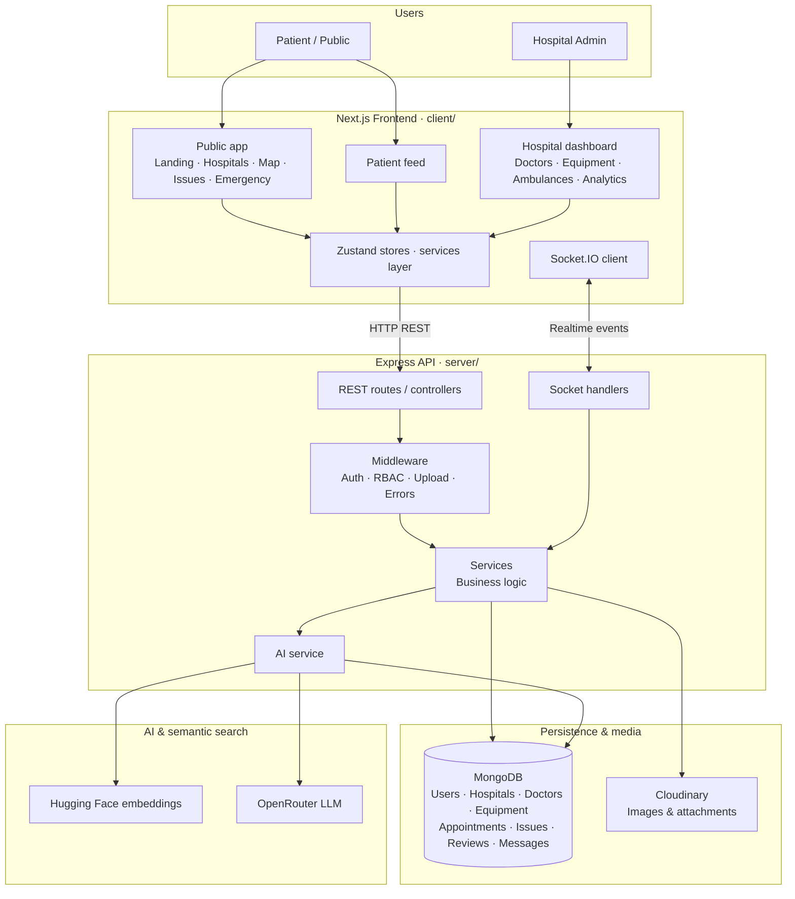
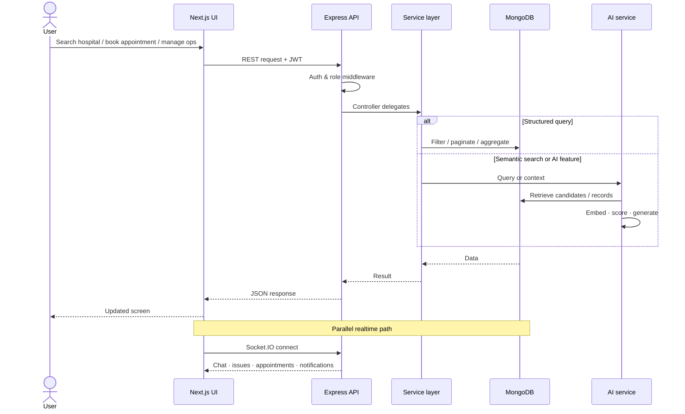
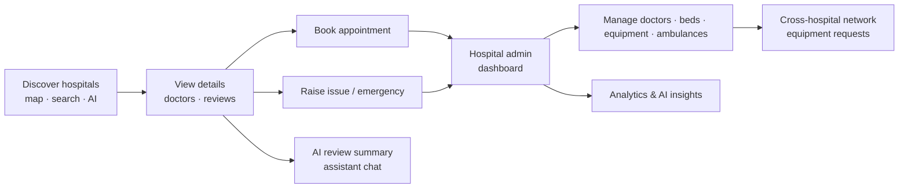

# Swasth Setu(Hackathon Technovest 3.0)

AI-powered hospital, equipment, ambulance, and patient coordination platform.

Swasth Setu is designed as a connected healthcare operations network, not just a hospital listing product. It helps patients discover care faster, and it helps hospitals manage internal operations and collaborate with other hospitals during shortages, support requests, and emergency situations.

## Project Vision

The platform serves two primary sides of the network:

- Patients / public users
- Hospitals / hospital admins

The goal is to connect the full flow:

- patients search hospitals, doctors, facilities, and medical shops
- patients book appointments, raise issues, and request help
- hospitals manage doctors, equipment, ambulances, appointments, and issues
- hospitals collaborate with other hospitals for equipment and support
- AI improves discovery, summarization, and operational decision support

This repository is structured as an MVP-first hackathon codebase, but the architecture is modular enough to scale.

## Core Features

### Patient / Public Side

- Hospital discovery by city, state, treatment, specialty, facilities, and availability
- Hospital detail pages with doctors, reviews, ratings, and CTAs
- Appointment booking flow
- Public issue feed and issue creation
- Medical shop discovery
- Map-based hospital and medical shop exploration
- Global search across hospitals, doctors, equipment, and shops
- AI assistant page
- Emergency mode for quick hospital and support recommendations

### Hospital Side

- Protected hospital admin dashboard
- Doctor, equipment, ambulance, appointment, and issue management
- Hospital network page for cross-hospital equipment search
- Realtime notifications and updates
- Chat support
- Analytics and AI insight sections for dashboard workflows

### AI Layer

- Semantic hospital search
- Semantic equipment search
- Semantic medical shop search
- Review summarization
- AI assistant chat
- Emergency interpretation and guidance
- Dashboard insights

## Tech Stack

### Frontend

- Next.js (App Router)
- TypeScript
- Tailwind CSS
- Framer Motion
- Zustand
- Socket.IO client
- Recharts
- Leaflet / React Leaflet

### Backend

- Node.js
- Express
- TypeScript
- MongoDB
- Mongoose
- Socket.IO
- Multer / multipart upload handling

### AI / Search

- Hugging Face embeddings for semantic similarity
- OpenRouter / LLM-based text generation flows
- RAG-ready retrieval pipeline

### Deployment

- Frontend deployment target: Vercel
- Backend can be deployed separately on any Node.js-compatible platform

## Project Workflow

High-level view of how Swasth Setu fits together — users, frontend, backend, data, AI, and realtime updates.



### Typical request flow



### End-to-end care coordination flow



## Repository Structure

```text
Hackathonn/
|-- client/                      # Next.js frontend
|   |-- app/                     # App Router pages, layouts, route groups
|   |-- components/              # Reusable UI and feature components
|   |-- hooks/                   # Shared React hooks
|   |-- lib/                     # API helpers, utilities
|   |-- public/                  # Static frontend assets (images, favicon, etc.)
|   |-- services/                # Frontend service layer for backend APIs
|   |-- socket/                  # Socket.IO client setup
|   |-- store/                   # Zustand state stores
|   |-- types/                   # Shared frontend types
|   |-- .env.example             # Frontend env template
|   |-- next.config.ts           # Next.js config
|   |-- postcss.config.mjs       # PostCSS / Tailwind config
|   |-- package.json
|   `-- tsconfig.json
|
|-- server/                      # Express backend
|   |-- src/
|   |   |-- config/              # Env, DB, external service config
|   |   |-- controllers/         # Request handlers
|   |   |-- middleware/          # Auth, RBAC, uploads, error handling
|   |   |-- models/              # Mongoose schemas and models
|   |   |-- routes/              # API route definitions
|   |   |-- scripts/             # Seed and utility scripts
|   |   |-- services/            # Business logic
|   |   |-- sockets/             # Realtime event handling
|   |   |-- types/               # Backend-specific shared types
|   |   |-- utils/               # Query builder, helpers, embedding text builders
|   |   |-- app.ts               # Express app wiring
|   |   `-- server.ts            # HTTP server entry point
|   |-- .env.example             # Backend env template
|   |-- package.json
|   `-- tsconfig.json
|
|-- .editorconfig                # Editor formatting defaults
|-- .gitattributes               # Line-ending normalization
|-- .gitignore
|-- package.json                 # Root scripts (dev, build, install:all)
`-- README.md
```

## Backend Architecture

The backend follows a modular service-oriented structure:

- Routes define the API endpoints
- Controllers handle HTTP request / response flow
- Services contain business logic
- Models represent MongoDB collections
- Middleware handles authentication, authorization, validation, uploads, and errors
- Socket handlers manage realtime events
- Utilities provide shared helpers such as pagination, filtering, similarity scoring, and embedding text building

Typical request flow:

```text
Route -> Controller -> Service -> Model / DB
```

Realtime flow:

```text
Socket Event -> Socket Handler -> Service -> DB / Emit Update
```

## Main Data Models

The current platform is centered around these collections:

- User
- Hospital
- Doctor
- Equipment
- Ambulance
- Appointment
- Issue
- Review
- Message
- MedicalShop

## Frontend Architecture

The frontend is built with reusable feature modules and service-based API access:

- `app/` contains route groups for public and hospital experiences
- `components/` contains reusable building blocks for landing, dashboard, discovery, chat, media, reviews, and more
- `services/` centralizes backend calls
- `store/` manages auth, toasts, and notification state
- `socket/` manages a shared Socket.IO client
- `hooks/` contains reusable logic like auth syncing, socket listeners, async state, and notifications

This keeps the UI modular while avoiding unnecessary overengineering for a hackathon MVP.

## API Overview

The backend exposes REST APIs for:

- `/api/auth`
- `/api/hospitals`
- `/api/doctors`
- `/api/equipment`
- `/api/ambulances`
- `/api/appointments`
- `/api/issues`
- `/api/reviews`
- `/api/messages`
- `/api/medical-shops`
- `/api/analytics`
- `/api/ai`
- `/api/search`

List APIs support filtering, sorting, and pagination through reusable query utilities.

## Realtime Layer

Socket.IO is used for lightweight realtime workflows such as:

- chat messages
- issue creation / updates
- equipment updates
- appointment updates
- notification events

The frontend reuses a shared socket client and listens only where needed to avoid duplicate listeners.

## AI and RAG Architecture

### What the AI layer does today

The repository already includes practical AI features:

- semantic hospital search
- semantic equipment search
- semantic medical shop search
- review summarization
- assistant chat
- emergency interpretation
- dashboard insight generation

### Embeddings and Vector Search

For semantic search, the backend converts structured records into descriptive text and then creates embeddings.

Examples:

- hospital embedding text includes name, city, state, specialties, departments, and facilities
- equipment embedding text includes name, type, and section
- medical shop embedding text includes name, area, city, and medicines

These embeddings are stored in MongoDB as numeric vectors and compared using cosine similarity.

Current retrieval pattern:

```text
User query -> query embedding -> candidate fetch from MongoDB -> similarity scoring -> ranked results
```

This is a practical hackathon approach that keeps infrastructure simple while still supporting semantic search.

### RAG Principle in This Project

RAG stands for Retrieval-Augmented Generation.

Simple idea:

1. retrieve relevant data from your own system
2. pass that context to the LLM
3. generate a grounded answer using that retrieved information

In Swasth Setu, the retrieval side already exists through semantic search and structured DB queries. The generation side already exists through review summarization, assistant chat, emergency interpretation, and dashboard insights.

So the project is best described as:

- AI-enabled today
- RAG-ready by architecture
- partially retrieval-augmented in practice

### Current RAG-Ready Flow

```text
User question
-> semantic or structured retrieval
-> relevant hospitals / equipment / reviews / issues
-> context passed into AI service
-> generated answer or summary
```

This makes the system useful even if the AI layer is unavailable, because the core workflows still run on standard APIs and database logic.

## Analytics Layer

The backend includes analytics endpoints for hospital dashboards using MongoDB aggregation pipelines.

These endpoints provide:

- overview counts
- status distributions
- issue trends
- appointment trends
- equipment distributions
- top issue types
- most used equipment types

This makes the dashboard more demo-friendly and more realistic for operations use cases.

## Local Development Setup

### 1. Clone the repository

```bash
git clone <your-repo-url>
cd Hackathonn
```

### 2. Install dependencies

From the repo root:

```bash
npm run setup
```

This installs root, client, and server dependencies in one step.

### 3. Environment files

Create `client/.env.local` from `client/.env.example`:

```env
NEXT_PUBLIC_API_URL=http://localhost:5000
```

Create `server/.env` from `server/.env.example`.

Typical backend values include:

- `PORT`
- `MONGO_URI`
- `JWT_SECRET`
- `CLOUDINARY_CLOUD_NAME`
- `CLOUDINARY_API_KEY`
- `CLOUDINARY_API_SECRET`
- AI provider keys depending on the configured services

### 4. Run locally

From the repo root (starts client and server together):

```bash
npm run dev
```

Or run each app separately:

```bash
npm run dev:client
npm run dev:server
```

### 5. Production build

From the repo root:

```bash
npm run build
npm run start:server
npm run start:client
```

## Demo Story

A simple end-to-end demo flow for this project:

1. Patient searches for a hospital
2. Patient opens hospital details and reviews
3. AI summarizes reviews
4. Patient books an appointment
5. Patient raises an issue
6. Hospital admin sees and resolves the issue
7. Hospital admin searches equipment from another hospital
8. Dashboard and AI insight cards show operational context

## Notes

- AI features are intentionally assistive, not mandatory for core flows
- the app is designed to remain usable even if AI services fail
- build and dependency folders such as `.next/`, `dist/`, and `node_modules/` are excluded from Git

## License

This project is open source under the [MIT License](LICENSE).

